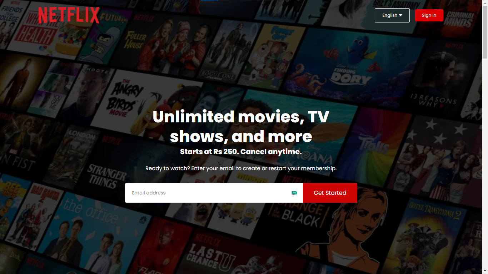

# Netflix Clone Project

Welcome to the Netflix Clone project! This project replicates the frontend interface of the popular streaming platform Netflix, showcasing a functional accordion, hero section, and footer. Whether you're interested in exploring frontend development or looking to integrate similar components into your project, this project provides a hands-on experience.

## Features

- **Hero Section:** Prominent section at the top of the page showcasing featured content or announcements.
- **Accordion:** Functional accordion component that expands and collapses sections to display additional content.
- **Footer:** Includes essential links and information such as About Us, Help, and Terms of Use.

## Live-Link 🔗: https://fahadshahbaz.github.io/Netflix-clone/
